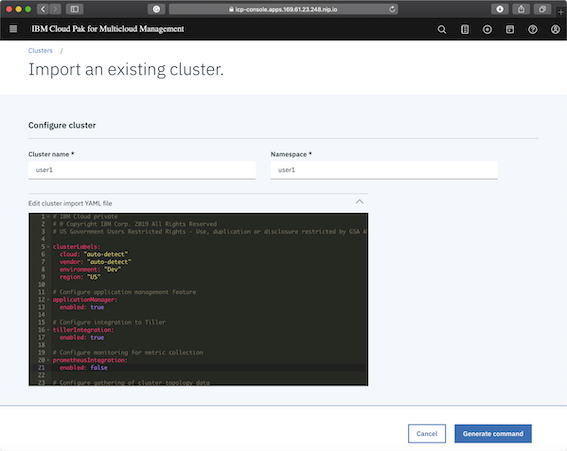

# Add a new Edge Cluster

<!-- TOC -->

- [Add a new Edge Cluster](#add-a-new-edge-cluster)
  - [Connect to the Edge Hub Cluster](#connect-to-the-edge-hub-cluster)
  - [Import cluster](#import-cluster)
    - [Explore the cluster import YAML](#explore-the-cluster-import-yaml)
    - [Generate and execute the Operator CURL Command](#generate-and-execute-the-operator-curl-command)
    - [Observe Operator command progress and results.](#observe-operator-command-progress-and-results)

<!-- /TOC -->

For this exercise you must use your own user account on the Edge cluster. You will be issues with details before the labs starts, but for this document, I will use `user02`.

The password for all the Edge cluster accounts is `ReallyStrongPassw0rd`

This process uses the [Kubernetes Operator Framework](https://github.com/operator-framework/getting-started) which is becoming more important for the management of K8S workloads.

When we federate a new cluster, the user account needs access to the cluster that will be used to connect to the cluster, and for deployment exercises, it will need access to namespaces representing entitlement and content.


## Connect to the Edge Hub Cluster

Login in with your supplied details - in my case `user02` `ReallyStrongPassw0rd`


`Hamburger` > `Clusters` then `add cluster`


## Import cluster

Select `import and existing cluster` and then press the `select` button


Make sure that the `namespace` that you use is the same as your userid. In our case `user02`. This is because this account has been authorised to use this `namespace` when it was configured before the lab started. Please user the same userid for the cluster name so that we can keep track of the teams.


### Explore the cluster import YAML



Uncomment the cluster labels and add some more.

Also turn set `Prometheus` integration to `false` for now. This is not normal operation, but uses unnecessary resources for this exercise.


### Generate and execute the Operator CURL Command

Finally generate the Command to perform the federation.

.

Copy this command into your clipboard.


Connect to your Edge Cluster Instance, something like this .... but get the details from your own 'edge-server' instance from `SkyTap`

```
ssh localuser@services-uscentral.skytap.com -p 12345
localuser@services-uscentral.skytap.com's password:
Welcome to Ubuntu 16.04.6 LTS (GNU/Linux 4.4.0-159-generic x86_64)
.
Last login: Mon Jan 13 10:41:38 2020 from 217.155.198.195
localuser@edge-server:~$
```

Now paste your copied command into your Edge server Terminal session and execute it.


### Observe Operator command progress and results.

If you look at the cluster `pods` on your Edge cluster after a while you will see ...

```
localuser@edge-server:~$ kubectl get pods -n multicluster-endpoint
NAME                                                  READY   STATUS        RESTARTS   AGE
endpoint-appmgr-66f667b747-4gzr8                      2/2     Running       0          33m
endpoint-appmgr-helm-crd-68ddc687d5-w5kqp             2/2     Running       0          3d5h
endpoint-component-operator-5f99c5585-628k8           1/1     Running       2          3d5h
endpoint-connmgr-6d46fcfdbd-cnvcb                     1/1     Running       0          33m
endpoint-policyctrl-6bfc8b86d5-6h7z5                  2/2     Running       0          33m
endpoint-search-64c446c455-x2mvt                      1/1     Running       0          33m
endpoint-svcreg-coredns-6b4cc779f8-dxhtt              1/1     Running       0          3d5h
endpoint-svcreg-dc69bf8bd-bfqlg                       1/1     Running       0          33m
endpoint-topology-weave-collector-7d56cc4f5b-2gpg8    1/1     Running       0          33m
endpoint-topology-weave-scope-app-66bc8c954b-qc477    2/2     Running       0          3d5h
endpoint-topology-weave-scope-rspfd                   1/1     Running       0          3d5h
endpoint-workmgr-75fbf96f56-wcp4p                     1/1     Running       0          33m
ibm-multicluster-endpoint-operator-7d7f957bbb-htrjp   1/1     Running       0          3d5h

```

Finally look at the available clusters through the Edge Hub GUI and you will see you registered cluster.


This completes this exercise.
