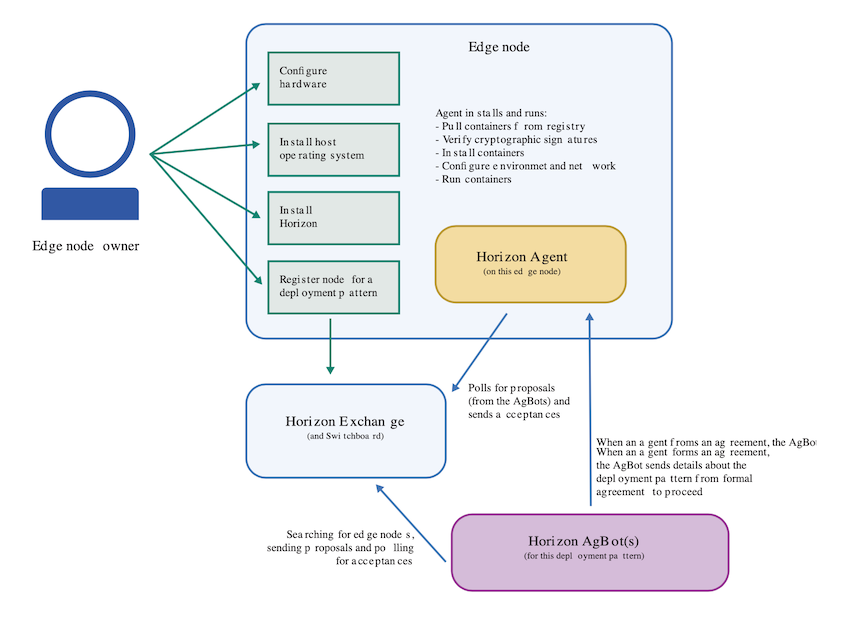
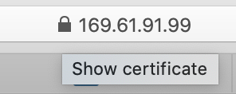
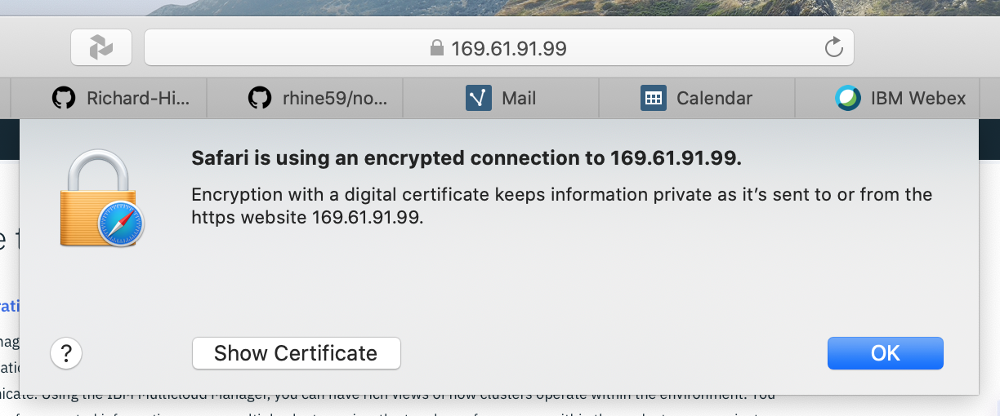
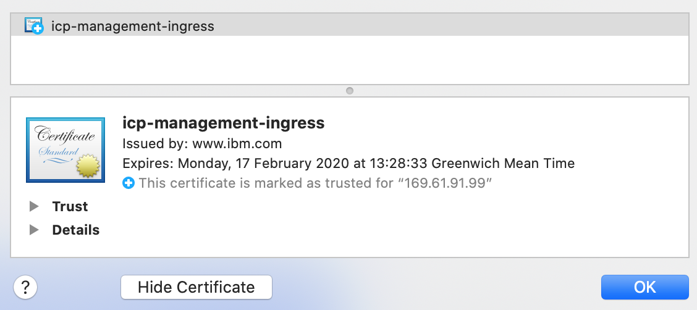
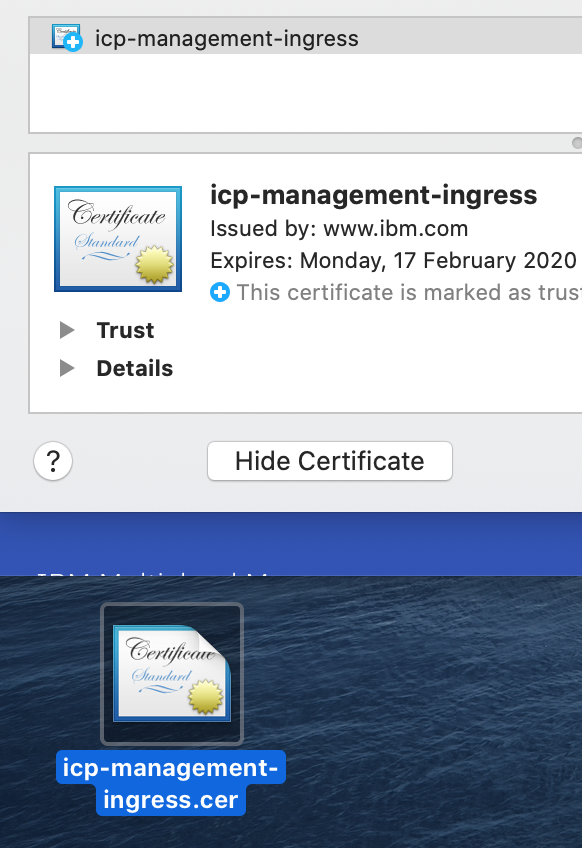
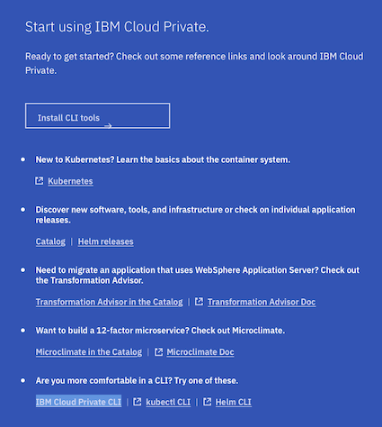

# Preparing your Edge Development environment on your Mac

You only need to do this if you are going to use your MAC as a development workstation for Edge Services. This is optional!

The documented steps are taken from [here](https://www.ibm.com/support/knowledgecenter/SSFKVV_3.2.1/devices/installing/adding_devices.html) but I will assume that you are working from a Mac as Windows is not supported as a development host.



## MacOS prerequisites

[Install Docker](https://docs.docker.com/docker-for-mac/install/)

[Install socat](http://macappstore.org/socat/)

See [here](https://github.ibm.com/Richard-Hine/OnTheEdge/tree/master/development)

Import the horizon-cli package certificate into your MacOS keychain:

```
macbook:development rhine$ wget http://pkg.bluehorizon.network/macos/certs/horizon-cli.crt
--2020-01-06 12:23:41--  http://pkg.bluehorizon.network/macos/certs/horizon-cli.crt
Resolving pkg.bluehorizon.network (pkg.bluehorizon.network)... 169.45.88.181
Connecting to pkg.bluehorizon.network (pkg.bluehorizon.network)|169.45.88.181|:80... connected.
HTTP request sent, awaiting response... 200 OK
Length: 1123 (1.1K) [application/x-x509-ca-cert]
Saving to: ‘horizon-cli.crt’

horizon-cli.crt                              100%[==============================================================================================>]   1.10K  --.-KB/s   in 0s     

2020-01-06 12:23:41 (76.5 MB/s) - ‘horizon-cli.crt’ saved [1123/1123]

macbook:development rhine$ sudo security add-trusted-cert -d -r trustRoot -k /Library/Keychains/System.keychain horizon-cli.crt
Password:
macbook:development rhine$
```

## Install, configure and validate the Horizon package

Download and install the latest version of the Horizon package - check for the [latest version here](http://pkg.bluehorizon.network/macos/) or you can get the package versions as follows.

```
macbook:development rhine$ wget -q -O - http://pkg.bluehorizon.network/macos/
<html>
<head><title>Index of /macos/</title></head>
<body bgcolor="white">
<h1>Index of /macos/</h1><hr><pre><a href="../">../</a>
<a href="certs/">certs/</a>                                             26-Feb-2019 15:05                   -
<a href="testing/">testing/</a>                                           11-Dec-2019 19:12                   -
SOME LINES MISSING!
<a href="horizon-cli-2.23.29.pkg">horizon-cli-2.23.29.pkg</a>                            07-Oct-2019 21:36             8302164
SOME LINES MISSING!
</pre><hr></body>
</html>
```
So to install the latest version on your MAC

```
macbook:development rhine$ wget http://pkg.bluehorizon.network/macos/horizon-cli-2.23.29.pkg
--2020-01-06 12:31:21--  http://pkg.bluehorizon.network/macos/horizon-cli-2.23.29.pkg
Resolving pkg.bluehorizon.network (pkg.bluehorizon.network)... 169.45.88.181
Connecting to pkg.bluehorizon.network (pkg.bluehorizon.network)|169.45.88.181|:80... connected.
HTTP request sent, awaiting response... 200 OK
Length: 8302164 (7.9M) [application/octet-stream]
Saving to: ‘horizon-cli-2.23.29.pkg’

horizon-cli-2.23.29.pkg                      100%[==============================================================================================>]   7.92M   985KB/s   in 14s    

2020-01-06 12:31:35 (594 KB/s) - ‘horizon-cli-2.23.29.pkg’ saved [8302164/8302164]

macbook:development rhine$ sudo installer -pkg horizon-cli-2.23.29.pkg -target /
Password:
installer: Package name is horizon-cli-2.23.29
installer: Installing at base path /
installer: The install was successful.

```
Now setup some needed environment variables and re source your shell environment. You may need to modify this if you are not using the default MacOS shell.
```
echo source /usr/local/share/horizon/hzn_bash_autocomplete.sh >> ~/.bash_profile
. ~/.bash_profile
```

Stop the Horizon services. This is also a useful check that you have the prereqs installed and your environment setup.

```
macbook:development rhine$ horizon-container stop
Unregistering the node, then stopping/removing the horizon container (this may take a minute)...
Error response from daemon: No such container: horizon1
Error stopping container: horizon1. Resuming stop procedures.
Error: No such container: horizon1
Error removing container: horizon1. Resuming stop procedures.
Error: No such volume: horizon1_var
Error: No such volume: horizon1_etc
```

Point your edge device horizon agent to your Edge Hub cluster by creating or editing `/etc/default/horizon`. Note that there is an `/etc/defaults` directory on a MAC, but the Horizon agent expects the `horizon` file in `/etc/default` and not `/etc/defaults`
```
ICP_URL= https://mycluster.icp:10038
HZN_EXCHANGE_URL=$ICP_URL/ec-exchange/v1
HZN_FSS_CSSURL=$ICP_URL/ec-css/
```

Download the ICP certificate from the Edge Hub website by clicking on the padlock icon next to the Edge Hub URL in your browser. I am using Safari on a Mac, so these processes may vary with platform.



Select `show certificate`



See the certificate details



now drag the certificate icon onto your Desktop



I now moved this certificate to my working directory and installed it into my MAC keychain.

```
macbook:development rhine$ mv ~/Desktop/icp-management-ingress.cer .
macbook:development rhine$ sudo security add-trusted-cert -d -r trustRoot -k /Library/Keychains/System.keychain icp-management-ingress.cer
Password:
```

Start the Horizon services by running the following command:
```
macbook:etc rhine$ horizon-container start
latest: Pulling from openhorizon/amd64_anax
3b37166ec614: Pull complete
504facff238f: Pull complete
ebbcacd28e10: Pull complete
c7fb3351ecad: Pull complete
2e3debadcbf7: Pull complete
e4889c699432: Pull complete
8b1ca5f4c2f7: Pull complete
ad6b8aad2fd8: Pull complete
d251ed8bd949: Pull complete
ed300f29a02b: Pull complete
Digest: sha256:62e78faa0aea3cbbf5cc5c52a144f37e1ad7a7a47be7fb1c3982801b3a1fa8fc
Status: Downloaded newer image for openhorizon/amd64_anax:latest
docker.io/openhorizon/amd64_anax:latest
Starting the Horizon agent container openhorizon/amd64_anax:latest...
218a38358e27f239de14034434913176e552de26e3ada7e3018361070441f83d
Horizon agent started successfully. Now use 'hzn node list', 'hzn register ...', and 'hzn agreement list'
```

Verify that the Horizon service is running:
```
macbook:etc rhine$ hzn node list
{
  "id": "",
  "organization": null,
  "pattern": null,
  "name": null,
  "token_last_valid_time": "",
  "token_valid": null,
  "ha": null,
  "configstate": {
    "state": "unconfigured",
    "last_update_time": ""
  },
  "configuration": {
    "exchange_api": " https://mycluster.icp:10038/ec-exchange/v1/",
    "exchange_version": "",
    "required_minimum_exchange_version": "1.116.0",
    "preferred_exchange_version": "1.116.0",
    "mms_api": " https://mycluster.icp:10038/ec-css",
    "architecture": "amd64",
    "horizon_version": "2.23.29"
  },
  "connectivity": {
    "firmware.bluehorizon.network": true,
    "images.bluehorizon.network": true
  }
}
```
At this point we have a working Edge Service development environment!

## Register your development workstation to the Edge Hub Server.

Pick this up from [here](https://www.ibm.com/support/knowledgecenter/en/SSFKVV_3.2.1/devices/installing/advanced_man_install.html)

We will need some more local variables set for when we register the agent to the Hub

see `set_env.sh` in the [GitHub repository](https://github.ibm.com/Richard-Hine/OnTheEdge/blob/master/development/set_env.sh)

```
HZN_EXCHANGE_URL= https://mycluster.icp:10038/ec-exchange/v1
HZN_FSS_CSSURL=https://mycluster.icp:10038/ec-css
HZN_ORG_ID=local-cluster
HZN_EXCHANGE_USER_AUTH=iamapikey:x2ZrRmzdAEwpwYLlg0fuq9v-_j8bSp2xfYtTn9scrvV9
#HZN_NODE_ID=fs2020<your_initials_go_here>
HZN_NODE_ID=fs2020_krh
```

How do we generate the `HZN_EXCHANGE_USER_AUTH` key? Use the following `cloudctl` commands. The `cloudctl` binary can be downloaded from the ICP console. Generate your own key using the provided commands making sure you add your own name to the key description.



The direct link to the `cloudctl` download is [here](https://mycluster.icp:10038/console/tools/cli)

the `apikey.sh` script can be used to generate your own ICP IAM API Key

```
#!/bin/sh
# Generate an ICP API Key for use by agent authentication
cloudctl login -a https://mycluster.icp:10038 -u admin -p afro-donkey-seldom-waterfall-compute --skip-ssl-validation -n default
#cloudctl iam api-key-create edge -d "<your_name_goes_here" -f edge-api-key
cloudctl iam api-key-create edge -d "Richard Hine Edge API Key" -f edge-api-key
```
Run the script.

```
macbook:development rhine$ ./apikey.sh
Authenticating...
OK

Targeted account mycluster Account

Targeted namespace default

Configuring kubectl ...
Property "clusters.mycluster" unset.
Property "users.mycluster-user" unset.
Property "contexts.mycluster-context" unset.
Cluster "mycluster" set.
User "mycluster-user" set.
Context "mycluster-context" created.
Switched to context "mycluster-context".
OK

Configuring helm: /Users/rhine/.helm
OK
Deleting API key richard_hine as admin...
OK
API key richard_hine ApiKey-70137e31-6fc9-4c63-b07e-b19f04d52721 deleted
Creating API key richard_hine as admin...
OK
API key richard_hine created
Successfully saved API key information to edge-api-key
ID                                            Name              Description                   Created At              Last Updated   
ApiKey-a5f7dbe6-bd6d-4bde-9ece-5096def61c0b   glen              Glen's IAM API Key            2019-10-08T16:03+0000   2019-10-08T16:03+0000   
ApiKey-2b8d3d39-f1fc-40f8-aca2-641c039a1ed1   shared            Glen's shared IAM API Key     2019-10-08T18:35+0000   2019-10-08T18:35+0000   
ApiKey-831c576c-82f1-4316-96af-6f4e3b39aa80   edge              edge                          2019-10-08T18:41+0000   2019-10-08T18:41+0000   
ApiKey-604abeb5-255e-4ef3-913b-afba9204dfb5   bp-pltfm-apikey   bp test pltfm apikey          2019-10-08T20:46+0000   2019-10-08T20:46+0000   
ApiKey-dc09b8c6-9a70-4262-82e8-3eaab5aba9d2   bp-pltfm-apikey   bp test pltfm apikey          2019-10-08T21:16+0000   2019-10-08T21:16+0000   
ApiKey-0af80d6c-da02-4684-afe2-19b7b6fa38bf   richard_hine      FastStart 2020 Edge API Key   2020-01-07T14:31+0000   2020-01-07T14:31+0000
```
You can now use the contents of the `edge-api-key` for the `HZN_EXCHANGE_USER_AUTH` variable.

The `HZN_EXCHANGE_NODE_AUTH` variable is set as the node is registered.

## Sample Edge Service

Here is a [Sample Application](https://github.ibm.com/Richard-Hine/OnTheEdge/tree/master/application/faststart) that we will use in our edge device service deployment use cases. It returns a pair of random words each time you make a web services call via `curl -i <hostname>:2020`. This is not designed to represent any real workload but rather, just to response with content if active.

We will now follow these [instructions](https://www.ibm.com/support/knowledgecenter/SSFKVV_3.2.1/devices/developing/quickstart_example.html) in order to create an Edge Service using our sample application.

- SSH to your edge-node and then download the sample application
```
localuser@edge-device:~$ git clone https://github.com/rhine59/node.git
Cloning into 'node'...
remote: Enumerating objects: 12, done.
remote: Counting objects: 100% (12/12), done.
remote: Compressing objects: 100% (10/10), done.
remote: Total 12 (delta 0), reused 0 (delta 0), pack-reused 0
Unpacking objects: 100% (12/12), done.
Checking connectivity... done.
```
```
localuser@edge-device:~/node$ tree
.
├── build.sh
├── Dockerfile
├── exercise.sh
├── package.json
├── package-lock.json
├── README.md
└── server.js

0 directories, 7 files
```
We need to setup some environment variables before we build our service.

```
localuser@edge-device:~/horizon-edge-packages$ . ~/horizon-edge-packages/set_env.sh
```
and then check that they have been set ...

```
localuser@edge-device:~/horizon-edge-packages$ env|grep -i HZN
HZN_FSS_CSSURL=https://mycluster.icp:10038/ec-css
HZN_EXCHANGE_URL=https://mycluster.icp:10038/ec-exchange/v1
HZN_EXCHANGE_USER_AUTH=iamapikey:Dq5TwEXqa5OfPng4avBLtirASfkLQEGLXdm6fDJygez8
HZN_ORG_ID=local-cluster
HZN_NODE_ID=wlodek-lab-test-1
HZN_EXCHANGE_NODE_AUTH=91ebfd622fff09987c7712ccbd7ad907b0fb6b7c:GjlrRtAnqvNzlqkCgOcvtLfl9bD0yFVFh4ZN3OytmOTVp
```
the product manuals talk about the `DOCKER_HUB_ID` variable, but this is not needed in our simple environment.

Create the `edge service metadata` for the project:

```
hzn dev service new -s fs2020 -V 1.0.0 -i fs2020 --noImageGen

Created horizon metadata files in /home/localuser/node/horizon. Edit these files to define and configure your new service.
```

Build the container. The container image name must match what is referenced in `./horizon/service.definition.json` .

GOT THIS FAR - NEED TO CHECK THIS OUT!


```
eval $(hzn util configconv -f horizon/hzn.json)
export ARCH=$(hzn architecture)
sudo docker build -t "${DOCKER_IMAGE_BASE}_$ARCH:$SERVICE_VERSION" .
unset DOCKER_IMAGE_BASE SERVICE_NAME SERVICE_VERSION
```

### Build a service for an existing CONTAINER

```
hzn dev service new -o fs20edgem -s smartcart -V 1.0.0 -i rhine59/smartcart --noImageGen

Created horizon metadata files in /home/localuser/horizon-edge-packages/smartcart/horizon. Edit these files to define and configure your new service.
```

Check out the agent environment

```
cat ../agent-install.cfg

HZN_EXCHANGE_URL=https://fs20edgem.169.62.229.212.nip.io:8443/ec-exchange/v1
HZN_FSS_CSSURL=https://fs20edgem.169.62.229.212.nip.io:8443/ec-css
HZN_ORG_ID=fs20edgem
HZN_EXCHANGE_USER_AUTH=iamapikey:BNWVFGL4tYFI4SGIWTmqFi77s8YGPLoAsXC3H0C_S45z
```
there are no existing Services

```
localuser@edge-device:~/horizon-edge-packages/smartcart$ hzn exchange service list -u $HZN_EXCHANGE_USER_AUTH
[]

```
Create keys for publishing the service

```
....on-edge-packages/smartcart$ hzn key create "IBM" "richard.hine@uk.ibm.com"
Creating RSA PSS private and public keys, and an x509 certificate for distribution. This is a CPU-intensive operation and, depending on key length and platform, may take a while. Key generation on an amd64 or ppc64 system using the default key length will complete in less than 1 minute.
Created keys:
 	/home/localuser/.hzn/keys/service.private.key
	/home/localuser/.hzn/keys/service.public.pem
```
