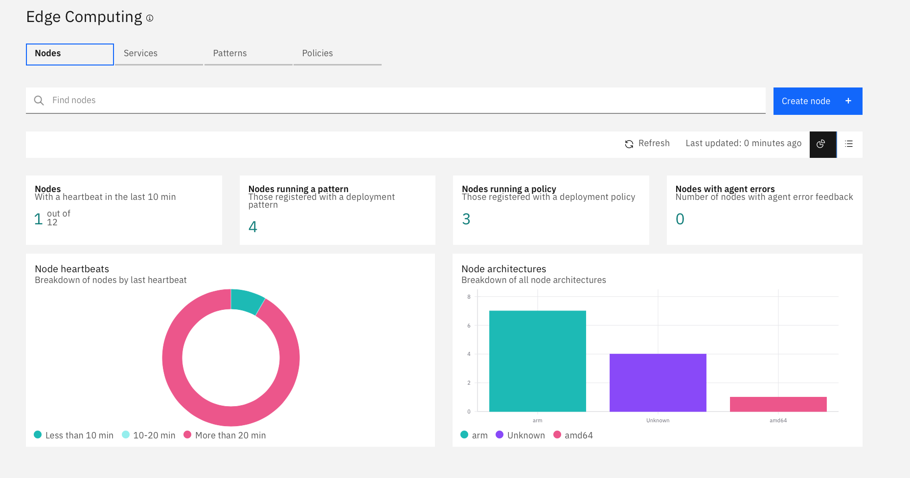
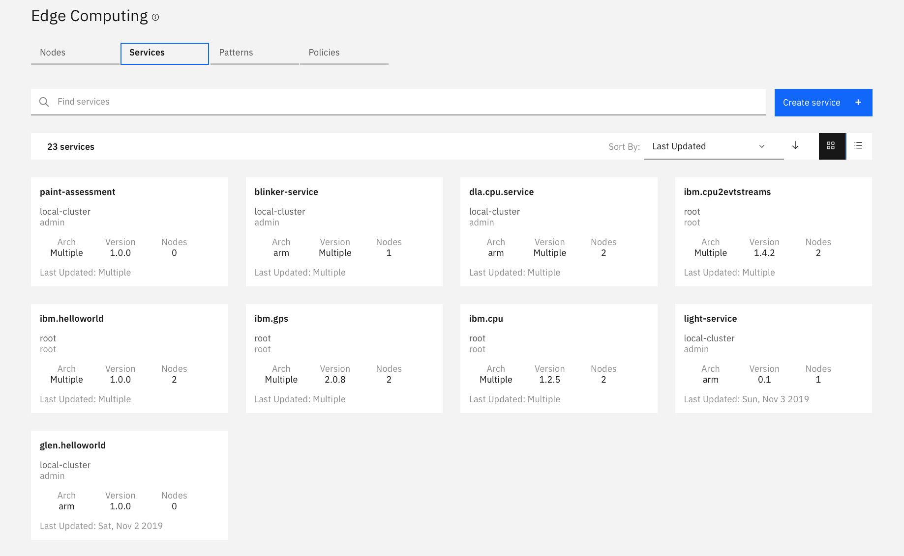
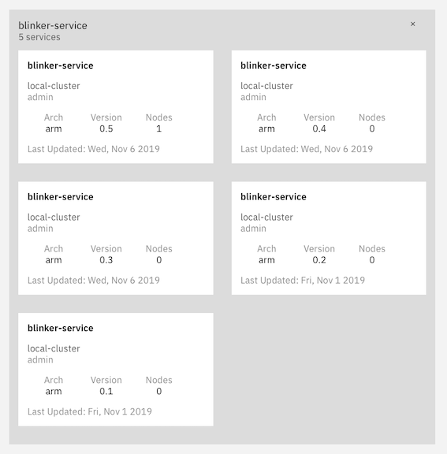
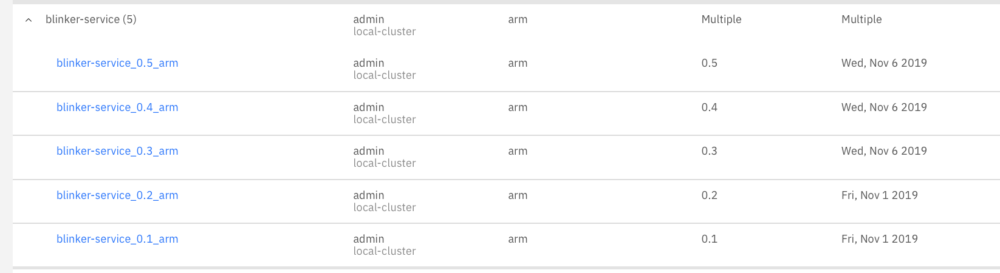
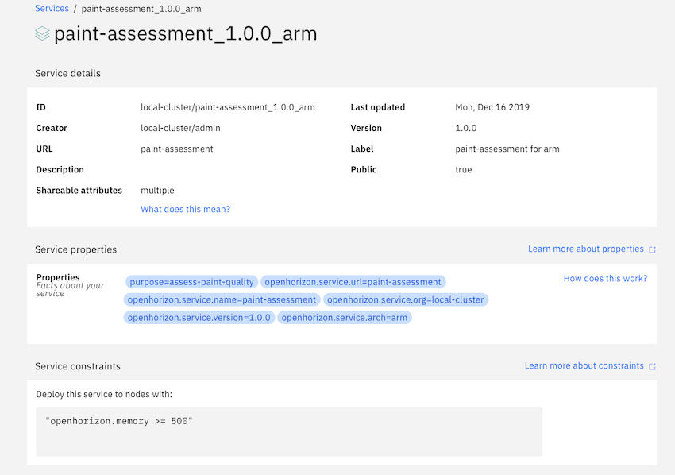
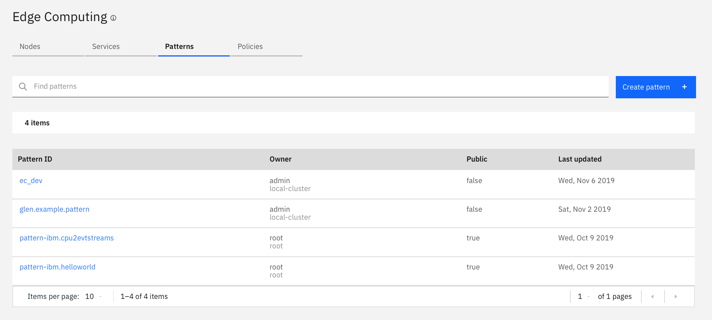
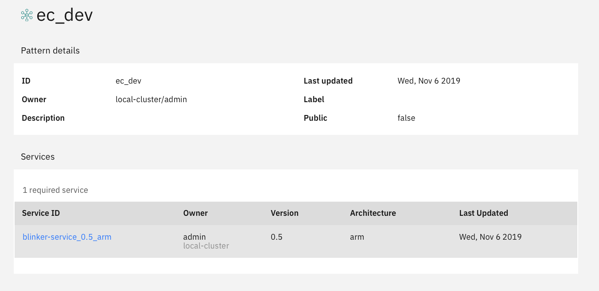
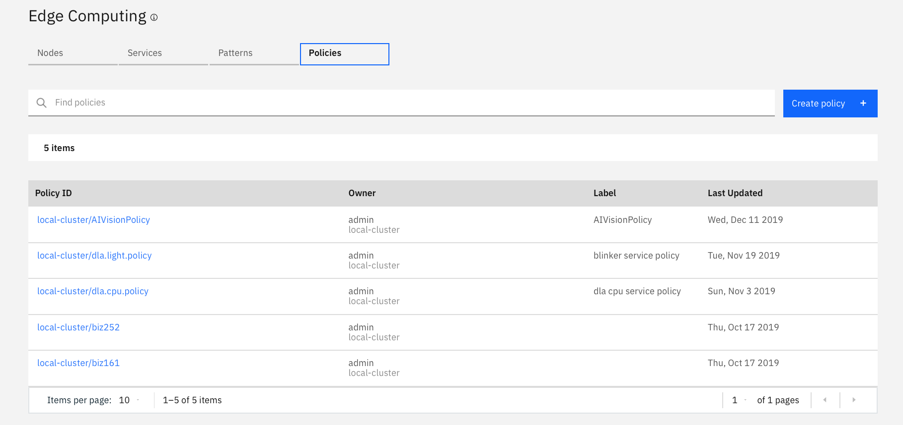
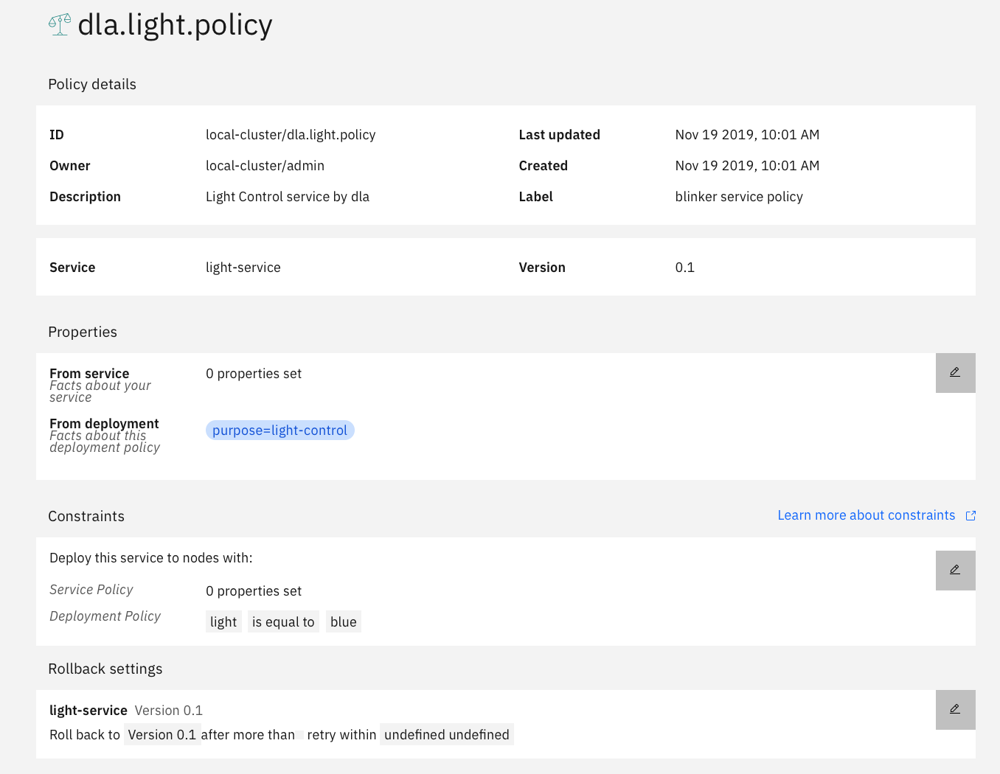

# A Tour of the Edge Management Server

I suggest that you use the `Firefox` browser rather than `Chrome` or other.

- Connect to the Edge Management Server.

Update your `etc/hosts` file With
```
# Faststart 2020 ICP Edge Cluster
170.225.222.149 mycluster.icp
```
then connect with

`https://mycluster.icp:10038/`

`admin/afro-donkey-seldom-waterfall-compute`

Once you have authenticated, you will need to then go to the following URL to see the Edge Hub details.

`https://mycluster.icp:10038/edge#/``



Explore the node tab, observing node architecture, health, tags and pattern affinity.

Now explore the services running on the nodes.



Select the `blinker service` and you will see there are `5` versions, all that run only on the `ARM` endpoint architecture.



This information can also be shown in a list form which may be better suited to your needs.



Have a look at the `paint-assessment` service and observe the service `properties` and `constraints`. This is used in the control of where the service will be deployed.



Now look at the `Edge Patterns`



The `ec-dev` Pattern ....



Now look at the `Edge Policies`



and select the `blinker service policy` and explore it's detail.



This concludes this quick tour of the Edge Console.
