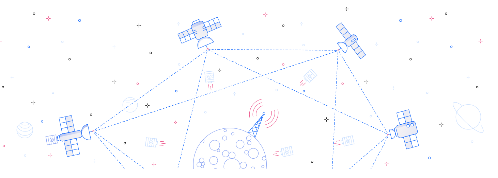

# OnTheEdge - IBM Edge Application Mnaager - FastStart 2020

[GitHub Pages](https://rhine59.github.io/OnTheEdge/)

Faststart 2020 lab materials providing an introduction to IBM Edge Application Manager

Table of Contents
- [Learning Objectives](#learning-objectives)
- [Some Advice](#some-advice)
- [Introduction](#introduction)
- [Lab Tutorial](#lab-tutorial)

# Learning Objectives

- Showcase IBM capabilities to manage edge workloads usng IBM Edge Application Manaer (former name IBM Edge Computing)
- Position IBM Edge Application Manager for managing different types of workloads:
    e.g. analytics (AI) and business logic  or middleware (Istio/Kafka, etc)
- Inspire the audience to think of potential use-cases in their industries

# Some Advice

This lab guide is not designed to be a `cut` and `paste` exercise. If this is what you do, then the learning value will be limited. Please use the short time you have to read, think and discuss with your colleagues so that you are ready for what is to come.

Have fun!

**Be patient!**

There is some latency in these labs, be patient and allow time for your changes to come into effect.

1. Do not use a refresh button provided on the Service, Pattern or Policy Tabs - the UI may go blank.If you Edge Hub GUI goes blank, then go `Hamburger menu` > `Edge Computing` to refresh the view.
2. Use `unique` names for your services, nodes and policies as we are working in a multi tenant environment.

3. [Connecting to the Lab environment](./ConnectToLabEnvrionment.md)

# Introduction

If you are totally not familar with IBM Edge Computing Manager and with *edge computing* idea in general, consider spending few minutes on reviewing the materials in the **Introductory & Reference materials** section below. This should help you understand what you are doing in the exercises.

# Lab Tutorial

1. [A Tour of the Edge web console](https://www.ibm.com/cloud/garage/dte/producttour/ibm-edge-computing-product-tour) - Optional

2. [Tutorial for Edge Device Lab](./EdgeDeviceLab.md)

3. [Tutorial for Edge cluster Lab](./EdgeServerLab.md) - Optional, if you finished the previous lab and there is still some time left

## Congratulations! If you get to this point you have completed the IBM Edge Application Manager lab.

Below links are provided for future reference

### Optional Activities

[Building a development environment on your Mac](./BuildingDevEnvironment.md)

### Introductory & Reference materials

[Edge Computing in 2 minutes](https://youtu.be/AF5ZkcnptMs)

[What is Edge Computing?](https://youtu.be/cEOUeItHDdo)

[DevOx Belgium - developing for the Edge](https://youtu.be/CCWbVjVqH20)

[IBM Edge Computing Technical demo](https://ibm.box.com/s/ela8d52klvba7qwx21fewln4fqfv2kcc)

[IBM Edge Node Patterns](https://ibm.box.com/s/6ik3zs0a5bh4swakywa5v90kmzf8ieik)

[IBM Edge Node Placement policy](https://ibm.box.com/s/rs2vftcch7xtszc31e7kakxa1mpuvk4a)

[Edge Node Management](https://ibm.box.com/s/1t8q4v1z7nxb5fhbzo0ajs7i0u1xykbd)

[Edge Installation](https://ibm.box.com/s/pwgvv5du2hji6cick2getbx6108ddbgl)

[Product manuals](https://www.ibm.com/support/knowledgecenter/SSFKVV_3.2.1/kc_welcome_containers.html)
